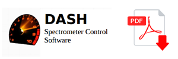
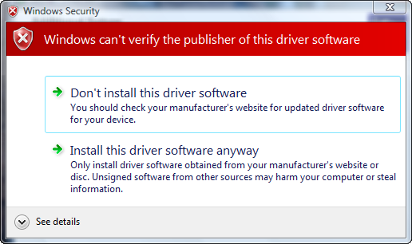
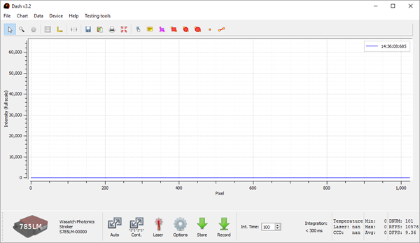

Title: Dash version 3.0 Manual
Date: 2016-05-25
Category: Manuals

**We are currently developing a new version of the Dash manual. Please check back soon for updates.**

# Dash Manual
1. Introduction and Installation
2. Software Interface.
3. Working with stored data.
4. External Input/Output control.
5. Troubleshooting.

## 1. Introduction

The Dash spectrrometer software is designed to provide 

### System Requirements
- **Operating Systems:** Windows 10, 8, and 7
- **Processor:** Intel i7 Suggested
- **RAM:** 4GB Required

## Installation
**Dash installation has been verified on Windows 7x32, 7x64, 10x64.**

1. Ensure that the spectrometer is **not** connected to the system.
2. Run the provided Dash-setup.exe file.
    - Accept all of the defaults during installation
    - If prompted that the publisher of the driver could not be verified, **Select Install this driver software anyway**.
    

3. Click **Finish** to launch the Dash application.
4. Connect your instrument to your computer using the appropriate USB cable. 
    - Windows will notify you that it is installing the driver software. This process may take a minute or two. Wait for it to finish and you will see the instrument connect in the software.
    
## 2. Software Interface
The instrument should be connected to the computer through the USB and powered using the supplied power adapter. The software is launched using the Dash shortcut in the Programs or All Apps menus. At first startup, the user should expect to see an interface like the following.

- **Red:** The main menu bar
- **Blue:** Chart Options
- **Center:** The center graph area is your reported spectra
- **Yellow:** Integration time setting and reporting.
- **Green:** Data summary and performance metrics
- **Teal:** Device Information
- **Purple:** Primary control buttons

**The Main Menu Bar** and **Chart Options Toolbar** are used to load and save data, as well as access chart viewing functions (such as auto-scaling).

**Integration Time Setting and Reporting** section allows you to specify (in ms) the length of the integration time of the image. Once this is set a counter will display how long until your next sample if your integration time is longer than 300ms.

**Data Summary** area will display temperature readbacks, minimum and maximum reported values, as well as performance metrics. 

**Device Information** area reports the instrument that is connected, along with it's serial number.

**Primary Control Buttons** include the Laser power control, Options Interface Toggle, and spectra storage buttons.
